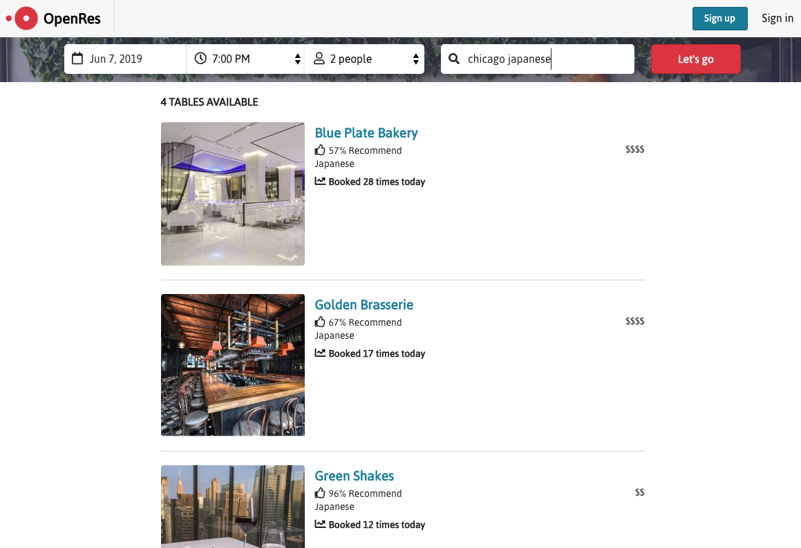

# OpenRes

OpenRes is modeled after OpenTable. Like OpenTable, OpenRes is a web application that primarily features searching for reservations at restaurants using a wide range of search parameters: 
* Date
* Time
* Party Size
* Location (i.e. city, zipcode, etc.)
* Cuisine
* Restaurant Name

Other features include: `(currently unavailable)`
* Making reservations
* Writing reviews
* Saving a restaurant to your favorites

Live Site: https://git.heroku.com/open-res.git

# Features:
## Restaurant Search
Users can search for multiple `keyword`s against multiple restaurant data columns. This feature implements the gem `PgSearch`. 

